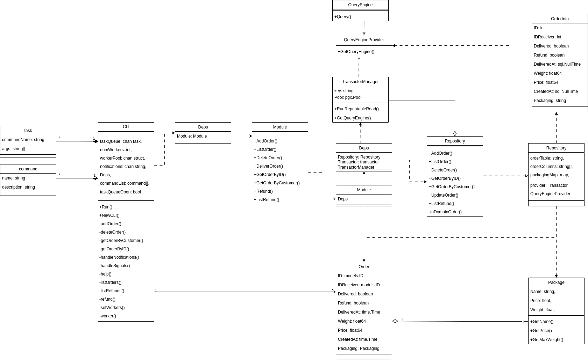

## Домашнее задание №4 «Выдача заказов в разной упаковке»
### Цель:

Модифицировать ваш сервис, добавить возможность в ПВЗ выдавать заказы в любой из трех различных упаковок

### Основное задание:

- **Модифицируйте Go-приложение**, добавьте в метод "Принять заказ от курьера" возможность передавать параметр упаковки
- Всего есть три вида упаковки: пакет, коробка, пленка
- Реализуйте функционал так, чтобы в будущем можно было просто добавить еще один вид упаковки
- При выборе пакета необходимо проверять, что вес заказа меньше 10 кг, если нет, то возвращаем информативную ошибку
- При выборе пакета стоимость заказа увеличивается на 5 рублей
- При выборе коробки необходимо проверить, что вес заказа меньше 30 кг, если нет, то возвращаем информативную ошибку
- При выборе коробки стоимость заказа увеличивается на 20 рублей
- При выборе пленки дополнительных проверок не требуется
- При выборе пленки стоимость заказа увеличивается на 1 рубль

### Дополнительное задание:

- Опишите архитектуру своего решения любым известным стандартом (например, UML)
- В MR вложите файл с описанием архитектуры
- При выборе стандарта необходимо описать, какой был выбран стандарт и дать ссылку на его документацию
- Запрещается использовать генерилки диаграмм, а также инструменты генерации связей между таблицами в БД в качестве описания 

### Дедлайны сдачи и проверки задания: 
- 22 июня 23:59 (сдача) / 25 июня, 23:59 (проверка)

UML был выбран для моделирования данной архитектуры из-за его способности четко и наглядно отображать взаимосвязи между компонентами системы, обеспечивая ясность и структурированность проектирования. 
[UML документация](https://www.omg.org/spec/UML/).
## Архитектура проекта:
* CLI обеспечивает первоначальную обработку сигналов от пользователя
* Module реализует основную логику работы приложения
* Repository взаимодействует с БД
* Transactor управляет транзакциями, предоставляет интерфейс для выполнения SQL-запросов
* Order представляет собой структуру заказа
* Packaging является интерфейсом, который реализуется через объекты Box, Bag, Film, NoPackaging
* task, command объекты необходимые для создания задач и комманд соответственно